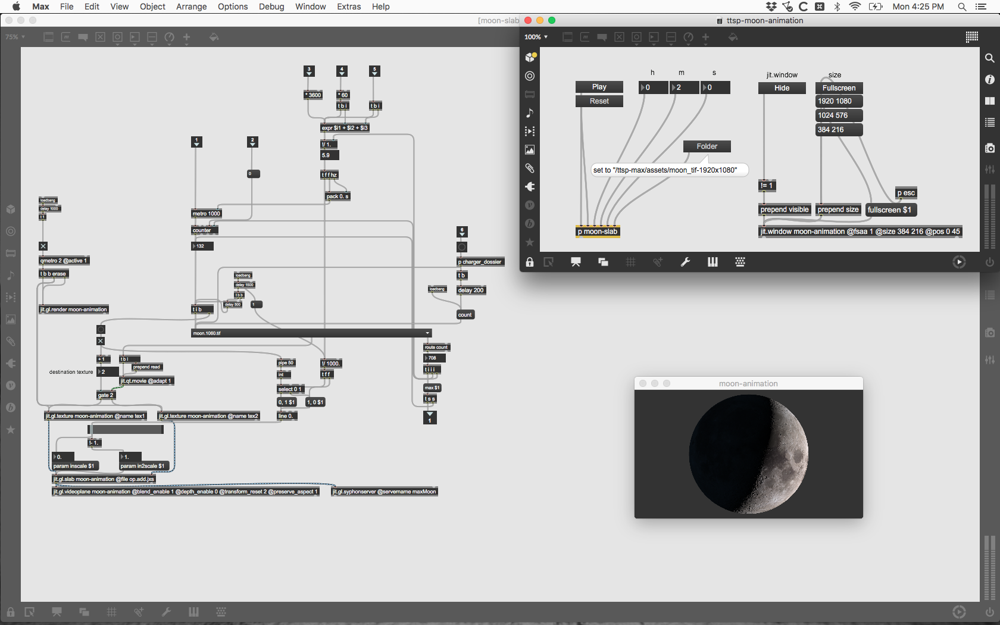

# Toward the South Plains

(Ongoing)

In collaboration with [Harlan Hodges](https://harlanhodges.com)

## Role

Immersive sound design, lyricist, photographer, programmer, web developer

## Performances

October 12 2019 St Andrew's Episcopal Church, Amarillo, TX

## Overview

_(This is a subjective expression of my direct involvement with the work. It is not my intent to blur the intentions of the project in any way. Visit [towardthesouthplains.com](http://www.towardthesouthplains.com) to learn how you can experience the work for yourself)._

On February 8, 2016 composer Harlan Hodges who has been like a brother to me was, let's see what the right word is...inspired; invoked; reduced...to write what would become the beginnings of Toward The South Plains after a phone call in which I would reveal that I was making my way back towards the south plains from Los Angeles after my father had been killed in an act of gun violence the previous afternoon.

Over the years the work has widened from focus on this singular circumstance to the all too common occurences of malice of the sort happening every day in our communities.

**Centered around the cyclical nature of existence, cycles of the moon and of water, stages of grief, the transmigration of the soul, and the constant presence of change in our lives, the work is highly conceptual and multidimensional in scope.** In its entirety it contains not only 30 pieces of written music for piano, organ, orchestra, and choir, but field recordings and photographs from across the southwestern united states, sound design,video, and animation. Plans for geomapped interactivity are being discussed as well.

### Programming

The cyclical nature of the moon is central to the theme of this work. Over 700 images of the moon were obtained from NASA's Scientific Visualization Studio and sequenced in **Max**. One lunar cycle is to be projected over the span of the piece but since the timing requirements vary drastically per performance, multiple methods of advancement have been programmed at the input level.

<iframe width="560" height="315" src="https://www.youtube-nocookie.com/embed/TKHHF3jsw8M" frameborder="0" allow="accelerometer; autoplay; encrypted-media; gyroscope; picture-in-picture" allowfullscreen></iframe>

### Photography

Over several trips through the southwestern United States, a series of photographs is being curated alongside audio field recordings and GPS data. These photographs correlate directly to one of nine major musical movements that outline the literal journey across the landscape. I've employed a Hasselblad 503cx 6x6 medium format film camera for this task.

### Field recordings & sound design

_coming soon_

### Lyrics

The introspectivity of my involvement as a lyricist proved to be personally healing. My self being a product of the West Texas landscape, I had spent many years trying to just get out. My conclusion has been that without the recognition that the body very much belongs to and is a product of a landscape, the spirit of the land will pull and plague the individual until one discerns in a very visceral way that no matter where one resides, the body we refer to as ourselves is but an aggregate of our past. Text has been set throughout the work in both English and Latin in order to contrast the subjective and objective scope of this phenomena.

The piece "Sacred Ground" is themed heavily after traditional hymns.

<pre>
Could it be sacred ground
That we wander
Estranged this soul be bound
Led asunder

A spirit ‘neath is found
Ancient wonder
Possess this sacred ground
We discover

Behold this sacred ground
Tears fall over
Beneath the stones be found
Holy water

Consume us sacred ground
Lest we wander
Eternally resound
Bear within us home
</pre>

<small>“Sacred Ground” © 2019 Harlan Hodges (ASCAP) Lyrics © 2019 Ryan Todd Garza (BMI)</small>
